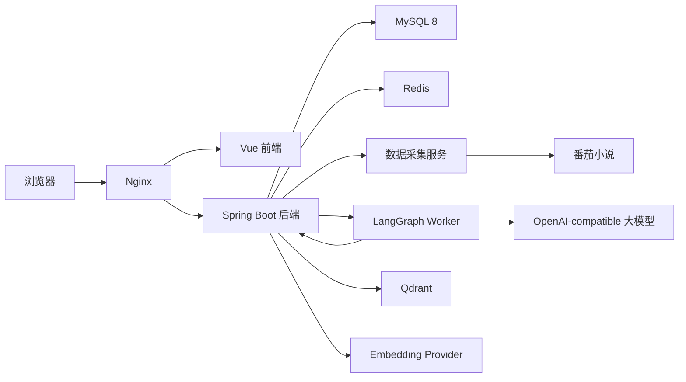

# Noval

Noval 是一个面向网文选题、榜单研判、单书拆解和 RAG 问答的全栈系统。当前版本聚焦番茄小说平台，提供从榜单采集、书籍搜索、章节抓取、AI 分析、趋势可视化，到网文知识库问答的完整链路。

当前发布标签：`V3`

## 核心能力

- 采集番茄榜单、书籍信息、简介、详情和章节内容。
- 支持单书 AI 分析，包括拆文、结构、情节、主题等分析方向。
- 支持榜单趋势分析，包括主题分布、热书列表、趋势摘要、历史对比和词云。
- 提供网文 AI 问答页，可用于网文创作建议、题材趋势分析、单书设定/卖点/结构提问。
- 支持 RAG 检索增强：书籍简介、章节、分析结果会切片后写入 MySQL 和 Qdrant。
- 支持番茄关键词搜索：数据采集服务返回候选书，用户选择目标书后，后端编排章节采集、入库、向量索引和问答分析。
- 支持密码登录、刷新 Token、可选短信登录、可选 Cloudflare Turnstile、人机校验和登录风控。

## 模块说明

| 目录 | 技术栈 | 主要职责 |
| --- | --- | --- |
| `frontend/` | Vue 3、Vite、TypeScript、Element Plus、Pinia、ECharts | 登录、榜单、分析、趋势、历史、配置、AI 问答页面 |
| `backend/` | Java 17、Spring Boot 3.2、MyBatis-Plus、Redis、MySQL | 鉴权、业务编排、数据持久化、调用数据采集服务、调用 LangGraph worker、SSE、RAG 索引和检索 |
| 数据采集服务 | FastAPI、httpx、BeautifulSoup、lxml、字体解码 | 番茄榜单、书籍、搜索、章节采集 |
| `langgraph-worker/` | FastAPI、LangGraph、OpenAI-compatible client | AI 执行、RAG 问答路由、意图识别、边界拦截、流式回答 |
| `docker/` | Nginx Dockerfile 和模板 | 生产环境前端静态资源托管和 API 反向代理 |
| `backend/sql/mysql/` | SQL 脚本 | MySQL 表结构和初始化数据 |

## 总体架构



AI 问答主链路：

1. 用户在 `/knowledge` 输入网文相关问题。
2. 后端把请求发送给 `langgraph-worker`。
3. Worker 判断问题意图，并把回答范围限制在网文创作、网文分析、榜单趋势和知识库问答内。
4. 趋势/RAG 问题会通过后端内部接口检索知识库。
5. 后端将用户问题向量化后查询 Qdrant。
6. Worker 基于检索来源生成带引用的回答。
7. 前端通过流式输出展示回答，并折叠显示引用来源。

选书问答链路：

1. 数据采集服务根据关键词返回番茄候选书。
2. 用户选择目标书。
3. 后端获取书籍详情和指定章节数量。
4. 后端把简介、章节和分析结果切片，写入 MySQL 与 Qdrant。
5. Worker 检索对应证据并生成回答。

## 功能范围

### 榜单与数据采集

- 番茄榜单采集。
- 榜单刷新和分页浏览。
- 书籍详情获取。
- 章节获取，用户侧默认控制在较小章节数，避免不必要的反爬压力。
- 番茄关键词搜索和候选书选择。

### 单书分析

- `deconstruct`：拆文。
- `structure`：结构分析。
- `plot`：情节分析。
- `theme`：主题分析。
- 支持流式输出。
- 分析结果写入 `analysis_result`。
- 支持提示词治理和模型绑定提示词配置。

### 趋势分析

- 基于当前榜单上下文做趋势分析。
- 支持趋势摘要、主题分布、词云、热书列表、历史对比。
- 前端有结构化展示工具，用于把模型输出转成可视化结果。

### 知识库与 RAG

- `knowledge_document` 和 `knowledge_chunk` 表结构。
- Qdrant 向量存储。
- 默认使用 DashScope OpenAI-compatible embedding 链路。
- 后端提供内部知识检索接口给 worker 调用。
- LangGraph 网文助手具备：
  - 网文问题边界拦截。
  - 前端短期记忆。
  - 上下文压缩传递。
  - 流式回答。
  - Markdown 渲染。
  - 引用来源折叠。
  - 引用修复：模型用了 RAG 来源但漏写 `[1]` 引用时，会用已检索来源生成带引用的兜底回答。

### 登录与安全

- 密码登录。
- Refresh Token 会话。
- 可选短信注册、短信登录、短信重置密码。
- 可选 Cloudflare Turnstile。
- 密码登录风控。
- 后端、数据采集服务、worker 之间使用内部 API Key 校验。

## 运行依赖

| 组件 | 要求 |
| --- | --- |
| Java | 17 |
| Maven | 推荐 3.9+ |
| Node.js | 推荐 20+ |
| npm | 推荐 10+ |
| Python | 3.11+ |
| MySQL | 8.0 |
| Redis | 推荐 7 |
| Qdrant | `qdrant/qdrant:v1.9.7` |
| Docker Compose | 生产式部署需要 |

## 环境变量

本地 Docker 可复制 `.env.example` 为 `.env`。生产环境建议把 env 文件放在仓库外，例如 `/etc/opt/noval/` 下。

不要提交真实密钥。

核心变量：

| 变量 | 用途 |
| --- | --- |
| `MYSQL_ROOT_PASSWORD` | MySQL root 密码 |
| `MYSQL_USER` / `MYSQL_PASSWORD` | 应用数据库账号 |
| `REDIS_PASSWORD` | Redis 密码 |
| `APP_DOMAIN` / `ROOT_DOMAIN` | Nginx 域名配置 |
| `NGINX_SSL_DIR` | 宿主机 TLS 证书目录 |
| `JWT_SECRET` | JWT 签名密钥 |
| `CONFIG_SECRET_MASTER_KEY` | 配置密钥主密钥 |
| 数据采集内部密钥 | 后端调用数据采集服务的内部密钥 |
| `AI_LANGGRAPH_WORKER_INTERNAL_API_KEY` | 后端调用 worker 的内部密钥 |
| `DEEPSEEK_API_KEY` | 默认 OpenAI-compatible 对话模型密钥 |
| `DASHSCOPE_API_KEY` | 默认 embedding 密钥 |
| `CLOUDFLARE_TURNSTILE_*` | 可选 Turnstile 配置 |
| `ALIYUN_DYPNS_*` | 可选短信服务配置 |

RAG 默认配置：

```env
KNOWLEDGE_QDRANT_BASE_URL=http://qdrant:6333
KNOWLEDGE_QDRANT_COLLECTION=novel_knowledge_chunks
KNOWLEDGE_EMBEDDING_PROVIDER=dashscope
KNOWLEDGE_EMBEDDING_BASE_URL=https://dashscope.aliyuncs.com/compatible-mode/v1
KNOWLEDGE_EMBEDDING_MODEL=text-embedding-v4
KNOWLEDGE_EMBEDDING_DIMENSION=1024
KNOWLEDGE_EMBEDDING_API_KEY_REF=DASHSCOPE_API_KEY
KNOWLEDGE_INDEX_MAX_CHAPTERS=10
KNOWLEDGE_INDEX_MAX_ACTIVE_JOBS=1
```

## Docker 部署

生产式部署由 `docker-compose.yml` 编排。

```bash
cd /opt/noval

docker compose --env-file /etc/opt/noval/ssl/.env build backend langgraph-worker nginx
docker compose --env-file /etc/opt/noval/ssl/.env up -d
docker compose --env-file /etc/opt/noval/ssl/.env ps
```

健康检查：

```bash
curl -s https://www.example.com/api/system/health

docker compose --env-file /etc/opt/noval/ssl/.env logs --tail=100 backend
docker compose --env-file /etc/opt/noval/ssl/.env logs --tail=100 langgraph-worker
```

在 Docker 网络内检查 Qdrant：

```bash
docker run --rm --network noval_default curlimages/curl:8.10.1 http://qdrant:6333/healthz
```

## 数据库初始化与升级

新 MySQL volume 会自动执行：

```text
backend/sql/mysql/
```

如果是从旧版本数据库升级，恢复旧库后可以按需执行新增阶段脚本：

```bash
docker compose --env-file /etc/opt/noval/ssl/.env exec -T mysql \
  sh -c 'mysql -uroot -p"$MYSQL_ROOT_PASSWORD" novel_analyzer' \
  < backend/sql/mysql/phase5-schema.sql

docker compose --env-file /etc/opt/noval/ssl/.env exec -T mysql \
  sh -c 'mysql -uroot -p"$MYSQL_ROOT_PASSWORD" novel_analyzer' \
  < backend/sql/mysql/phase6-schema.sql

docker compose --env-file /etc/opt/noval/ssl/.env exec -T mysql \
  sh -c 'mysql -uroot -p"$MYSQL_ROOT_PASSWORD" novel_analyzer' \
  < backend/sql/mysql/phase7-knowledge-schema.sql
```

提示词治理修复脚本：

```text
backend/sql/mysql/phase5-prompt-governance-repair.sql
```

适用于老库里已有提示词配置，但缺少有效发布版本的场景。

## 本地开发

### 前端

```bash
cd frontend
npm install
npm run dev
npm run type-check
npm run test
```

### 后端

```bash
cd backend
mvn spring-boot:run
mvn test
```

### 数据采集服务

```bash
cd <data-collector-service-directory>
python -m venv .venv
.venv\Scripts\activate
pip install -r requirements.txt
python -m uvicorn app.main:app --host 127.0.0.1 --port 5000
python -m unittest discover -s tests -v
```

### LangGraph Worker

```bash
cd langgraph-worker
python -m venv .venv
.venv\Scripts\activate
pip install -r requirements.txt
python -m uvicorn app.main:app --host 127.0.0.1 --port 8001
python -m pytest tests -q
```

## 常用验证命令

Worker/RAG 相关验证：

```bash
cd langgraph-worker
python -m pytest tests/test_novel_research_agent.py tests/test_knowledge_api.py tests/test_knowledge_client.py -q
```

前端 AI 问答验证：

```bash
cd frontend
npm run test -- KnowledgeChatView.spec.ts
npm run type-check
npm run build
```

后端编译：

```bash
cd backend
mvn -q -DskipTests compile
```

## 主要接口

认证：

- `POST /api/auth/login/password`
- `POST /api/auth/refresh`
- `POST /api/auth/logout`
- `POST /api/auth/sms/send`
- `POST /api/auth/login/sms`

数据采集：

- 榜单目录查询。
- 榜单分页查询。
- 榜单刷新。
- 书籍关键词搜索。
- 书籍详情查询。
- 章节内容查询与刷新。

分析：

- `POST /api/analysis/deconstruct`
- `POST /api/analysis/deconstruct/stream`
- `POST /api/analysis/structure`
- `POST /api/analysis/structure/stream`
- `POST /api/analysis/plot`
- `POST /api/analysis/plot/stream`
- `POST /api/analysis/theme`
- `POST /api/analysis/trend/stream`

知识库/RAG：

- `POST /api/knowledge/chat`
- `POST /api/knowledge/chat/stream`
- `POST /api/knowledge/index`
- `POST /api/knowledge/search`

配置：

- `GET /api/config/prompt`
- `PUT /api/config/prompt`
- `GET /api/config/system`
- `PUT /api/config/system`

## 安全规则

- 不要提交真实 `.env` 文件。
- 不要提交 API Key、密码、私钥、证书、Cookie、Token、Session。
- 不要提交数据库 dump、发布压缩包、日志、Redis dump、本地备份目录。
- 生产环境 env 文件放在仓库外。
- 提交前参考 `AGENTS_GIT_NOTE.md`。

推送前建议检查：

```bash
git status --short
git diff --cached --name-only
git ls-files | grep -E '(^|/)(\.env|.*\.env|env)$|\.(pem|key|p12|jks|kdbx)$|\.sql\.gz$|dump\.rdb$'
```

## 相关说明

- `AGENTS_GIT_NOTE.md`
