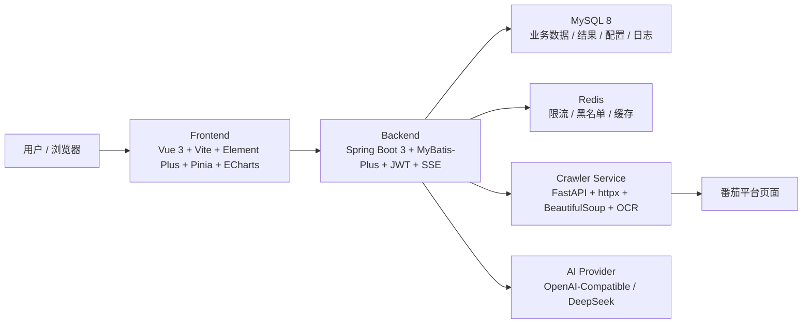

# Noval

一个面向网文选题、拆文和榜单趋势研判的全栈项目，当前 V1 聚焦番茄平台，提供“扫榜 -> 抓书 -> 抓章节 -> AI 分析 -> 趋势可视化 -> 历史回看”的完整链路。

## 主要功能

### 1. 榜单扫描

- 支持按平台、频道、榜单进行选择，当前已落地 `fanqie`
- 支持榜单分页、榜单刷新、用户偏好记忆
- 支持查看书籍详情、简介、作者、榜单快照信息

### 2. 单书分析

- 支持按 `1 / 3 / 5 / 10` 章抓取正文
- 支持三类分析：
  - `deconstruct` 拆文
  - `structure` 拆结构
  - `plot` 拆情节
- 支持 SSE 流式输出，优先边生成边返回
- 分析结果同时保存长文本与结构化 `result_json`

### 3. 趋势分析

- 基于当前选中的“频道 + 榜单”做趋势分析，不是全站混合分析
- 图表、词云、摘要、榜单对比都围绕当前榜单上下文展开
- 历史样本不足 3 次时，先展示已采集到的样本，不强制等满
- 支持查看分析摘要与详情长文

### 4. 历史与可视化

- 支持查看历史分析记录
- 支持趋势图、主题分布、历史词云、快照对比、热书列表等数据展示
- 已兼容桌面端与移动端核心流程

### 5. 登录与安全

- 支持登录、注册、登出、刷新 Token
- JWT 鉴权 + 角色校验
- Redis 限流、Token 黑名单、登录日志、操作日志
- 注册密码规则：至少 8 位，且包含大写字母、小写字母和数字

### 6. 配置能力

- 提示词配置管理
- 系统配置管理
- 可用模型列表下发
- 用户偏好配置持久化

## 当前范围

- 已实现平台：`fanqie`
- 预留未落地：`qidian`
- 当前 AI 通道以 `LangChain4j + OpenAI-Compatible` 为主
- 当前前端页面：
  - `/login`
  - `/rank`
  - `/analysis`
  - `/trend`
  - `/history`
  - `/config/prompt`
  - `/config/system`

## 架构设计

### 总体架构



### 模块职责

| 模块 | 技术栈 | 主要职责 |
| --- | --- | --- |
| `frontend/` | Vue 3 + Vite + TypeScript + Element Plus + ECharts | 登录、扫榜、分析、趋势、历史、配置页面，处理 JWT 会话与流式展示 |
| `backend/` | Spring Boot 3.2 + Java 17 + MyBatis-Plus + Redis | 鉴权、业务编排、SSE 推流、结果入库、配置管理、可视化数据聚合 |
| `crawler/` | FastAPI + httpx + BeautifulSoup4 + lxml + RapidOCR | 榜单抓取、书籍详情抓取、章节抓取、站点文本清洗 |
| `backend/sql/mysql/` | MySQL DDL / Seed | 用户权限、榜单快照、分析结果、提示词配置、趋势数据结构 |
| `docs/` | 设计与计划文档 | 项目总设计、前端接口设计、联调说明、阶段计划 |

### 关键数据流

1. 前端选择平台、频道、榜单后，请求后端获取榜单目录与榜单分页数据。
2. 后端优先读取 MySQL/Redis 中的榜单快照；缺失或主动刷新时，再调用爬虫服务抓取。
3. 用户查看详情或抓章时，后端调爬虫服务获取正文并落库。
4. 用户触发单书分析或趋势分析时，后端拼装提示词，调用 LangChain4j 对接 OpenAI-Compatible 模型。
5. 流式分析优先通过 SSE 把增量内容返回前端，同时将完整结果与结构化 JSON 写入数据库。
6. 趋势页再基于历史快照、历史分析结果与结构化 JSON 聚合出词云、图表、摘要与对比数据。

## 技术栈

### 前端

- Vue 3
- Vite
- TypeScript
- Element Plus
- Pinia
- Axios
- ECharts + vue-echarts
- vite-plugin-pwa

### 后端

- Java 17
- Spring Boot 3.2.5
- MyBatis-Plus 3.5.6
- Spring Validation
- Spring Security Crypto
- Spring Data Redis
- JJWT 0.12.5
- LangChain4j 1.12.1
- MySQL Connector/J

### 爬虫

- Python
- FastAPI
- Uvicorn
- httpx
- BeautifulSoup4
- lxml
- Pillow
- rapidocr_onnxruntime

### 基础设施

- MySQL 8
- Redis
- Docker Compose

## 目录结构

```text
noval/
├─ frontend/                # 前端工程
├─ backend/                 # 后端工程
│  ├─ src/main/java/        # 业务代码
│  ├─ src/main/resources/   # 应用配置
│  └─ sql/mysql/            # MySQL 初始化脚本
├─ crawler/                 # Python 爬虫服务
│  └─ app/                  # FastAPI 入口、路由、服务、模型
├─ redis/                   # Redis 配置
├─ docs/                    # 设计文档与联调文档
├─ docker-compose.yml       # 本地 / 联调编排
└─ .env.example             # 环境变量示例
```

## 核心数据设计

当前 MySQL 结构大致分为 5 类：

- 安全与权限：
  - `sys_user`
  - `sys_role`
  - `sys_user_role`
  - `sys_login_log`
  - `sys_operation_log`
  - `sys_ip_blacklist`
- 抓取与内容：
  - `crawl_book`
  - `crawl_rank`
  - `crawl_chapter`
  - `crawler_task`
- 榜单快照：
  - `rank_board`
  - `rank_snapshot`
  - `user_rank_preference`
- AI 与配置：
  - `prompt_config`
  - `system_config`
  - `user_config`
- 分析结果：
  - `analysis_result`

其中 `analysis_result.result_json`、`prompt_config.output_json_schema`、`prompt_config.parse_config_json` 是后续做结构化分析、可视化和更快落库的重要基础。

## 配置要求

### 运行环境要求

| 项目 | 要求 |
| --- | --- |
| JDK | 17 |
| Maven | 3.9+ 推荐 |
| Node.js | 20 LTS |
| npm | 10+ 推荐 |
| Python | 3.11+，本地已按 3.12 联调过 |
| MySQL | 8.0 |
| Redis | 5+ 或 7 |
| Docker | 支持 `docker compose` 的版本 |

### 必填环境变量

以下配置属于启动链路的核心要求：

| 变量名 | 是否必填 | 说明 |
| --- | --- | --- |
| `JWT_SECRET` | 是 | JWT 密钥，至少 32 个字符 |
| `CRAWLER_INTERNAL_API_KEY` | 是 | 后端与爬虫服务之间的内部调用密钥，至少 32 个字符 |
| `MYSQL_HOST` / `MYSQL_PORT` / `MYSQL_DATABASE` | 是 | MySQL 连接信息 |
| `MYSQL_USER` / `MYSQL_PASSWORD` | 是 | MySQL 账号密码 |
| `REDIS_HOST` / `REDIS_PORT` | 是 | Redis 连接信息 |
| `REDIS_PASSWORD` | 视环境而定 | Redis 若启用密码则必填 |
| `CRAWLER_BASE_URL` | 是 | 后端访问爬虫服务地址 |

### AI 相关配置

当前代码里，OpenAI-Compatible 模型密钥优先从后端进程环境变量读取，默认引用名为 `DEEPSEEK_API_KEY`。

推荐至少补齐：

| 变量名 | 说明 |
| --- | --- |
| `AI_OPENAI_COMPATIBLE_BASE_URL` | OpenAI-Compatible 基础地址，默认可用 `https://api.deepseek.com/v1` |
| `AI_OPENAI_COMPATIBLE_DEFAULT_MODEL` | 默认模型名，当前默认 `deepseek-chat` |
| `AI_OPENAI_COMPATIBLE_API_KEY_REF` | 密钥引用名，默认 `DEEPSEEK_API_KEY` |
| `DEEPSEEK_API_KEY` | 实际模型密钥，不要提交到仓库 |

补充说明：

- `system_config` 里有 AI 相关配置项，但真实密钥仍建议通过运行环境注入。
- 不要把任何模型 key、数据库密码、Redis 密码直接写入 Git。

### `.env` 使用方式

1. 复制 `.env.example` 为 `.env`
2. 将所有 `CHANGE_ME_*` 替换成真实值
3. `.env` 只用于本地或部署环境，不要提交到仓库

## 启动方式

### 方式一：Docker Compose

适合联调或一体化启动。

```powershell
Copy-Item .env.example .env
# 编辑 .env，填入真实密钥和密码
docker compose up -d --build
```

说明：

- 首次启动时，MySQL 会自动执行 `backend/sql/mysql/` 下的初始化脚本。
- 若需要 AI 分析能力，请确保后端容器能读取到实际模型密钥。
- `docker` 与 `docker compose` 需本机自行安装。

### 方式二：本地分服务启动

#### 1. 启动 Redis

准备一个可用的 Redis 实例即可，版本 5+ 或 7 均可。

#### 2. 启动爬虫服务

```powershell
cd crawler
pip install -r requirements.txt
$env:CRAWLER_INTERNAL_API_KEY = "<至少32位的内部调用密钥>"
python -m uvicorn app.main:app --host 127.0.0.1 --port 5000
```

#### 3. 启动后端

```powershell
cd backend
$env:JWT_SECRET = "<至少32位的JWT密钥>"
$env:CRAWLER_INTERNAL_API_KEY = "<与爬虫服务相同的密钥>"
$env:CRAWLER_BASE_URL = "http://127.0.0.1:5000"
$env:MYSQL_HOST = "127.0.0.1"
$env:MYSQL_PORT = "3306"
$env:MYSQL_DATABASE = "novel_analyzer"
$env:MYSQL_USER = "root"
$env:MYSQL_PASSWORD = "<你的MySQL密码>"
$env:REDIS_HOST = "127.0.0.1"
$env:REDIS_PORT = "6379"
$env:REDIS_PASSWORD = "<你的Redis密码，可为空>"
$env:DEEPSEEK_API_KEY = "<你的模型密钥>"
mvn spring-boot:run
```

#### 4. 启动前端

```powershell
cd frontend
npm install
npm run dev -- --host 127.0.0.1 --port 5173
```

### 健康检查

- 后端健康检查：`GET /api/system/health`
- 爬虫健康检查：`GET /health`

## 插件 / 开发工具要求

本项目没有“必须安装某个浏览器插件才能运行”的要求，核心功能全部走前后端服务调用。

如果你要做二次开发，建议开发工具具备以下能力：

- Java / Maven 支持
- Vue 3 / TypeScript 支持
- Python / FastAPI 支持
- Docker / Compose 支持
- MySQL / Redis 连接调试能力

如果使用 IDE：

- IntelliJ IDEA：建议启用 Java、Maven、HTTP Client、Docker、Database 相关支持
- VS Code：建议安装 Java、Python、Vue、TypeScript、Docker 相关扩展

这部分是开发效率建议，不属于项目运行时强依赖。

## 安全要求

- 不要把真实的模型密钥、数据库密码、Redis 密码、JWT 密钥提交到 Git
- `JWT_SECRET` 与 `CRAWLER_INTERNAL_API_KEY` 都应至少 32 位
- 注册密码必须满足大小写字母 + 数字 + 最少 8 位
- 生产环境建议启用独立数据库账号、Redis 密码和容器网络隔离

## 相关接口概览

### 认证

- `POST /api/auth/login`
- `POST /api/auth/register`
- `POST /api/auth/refresh`
- `POST /api/auth/logout`

### 榜单与内容

- `GET /api/crawler/boards`
- `GET /api/crawler/preference`
- `POST /api/crawler/preference`
- `GET /api/crawler/rank/page`
- `POST /api/crawler/rank/refresh`
- `GET /api/crawler/book/{id}`
- `POST /api/crawler/chapters`
- `POST /api/crawler/chapters/refresh`

### 分析与趋势

- `POST /api/analysis/deconstruct`
- `POST /api/analysis/deconstruct/stream`
- `POST /api/analysis/structure`
- `POST /api/analysis/structure/stream`
- `POST /api/analysis/plot`
- `POST /api/analysis/plot/stream`
- `GET /api/analysis/trend`
- `POST /api/analysis/trend/stream`

### 数据与配置

- `GET /api/data/history`
- `GET /api/data/visual`
- `GET /api/config/prompt`
- `PUT /api/config/prompt`
- `GET /api/config/system`
- `PUT /api/config/system`
- `GET /api/config/system/available-models`

## 相关文档

- [项目总设计 v2](docs/项目总设计-v2.md)
- [前端接口设计 v1](docs/前端接口设计-v1.md)
- [本地联调说明](docs/本地联调说明.md)
- [分步开发计划](docs/分步开发计划.md)

## 版本说明

- 当前主分支：`main`
- 已推送标签：`v1`
- 当前仓库远程：`origin -> https://github.com/flyon20/noval.git`
