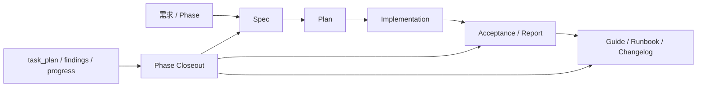

# Noval 文档治理与优化设计

> 文档 ID：`documentation-governance-design`
>
> 状态：`current`
>
> 最后审核：`2026-08-17`

## 1. 背景

Noval 已有大量按日期组织的需求规格、实施计划、验收报告、架构调研和三份 Phase 工作记录。问题不是“缺少每需求一个 Markdown”，而是缺少稳定的全局入口、生命周期、取代关系、发布边界和自动漂移检查。

本设计吸收 `D:\Git\bgxiong-ai-story-docs` 中可复用的文档分类、需求到验收追踪、故障证据和可执行检查，同时避免复制其静态版本漂移、状态模糊和多处重复索引。

## 2. 目标与非目标

目标：

- 让读者能从一个入口找到当前权威文档。
- 让 `task_plan.md`、`findings.md`、`progress.md` 成为正式文档的证据来源。
- 区分 current、draft、historical、superseded 和 archived。
- 逐文件控制 repository/private 发布边界。
- 用确定性脚本发现路径、链接、状态、取代关系和 ignore 漂移。

非目标：

- 不创建第二套需求归档目录。
- 不批量改写全部历史 specs/plans。
- 不把调研草稿、提示词、用户内容或生产敏感信息自动公开。
- 不让文档声明凌驾于源码、迁移、测试和运行配置。

## 3. 文档模型

三类材料必须分开：

| 类型 | 内容 | 权威性 |
| --- | --- | --- |
| 工作记录 | 计划、探索证据、执行账本 | 临时，不直接对外 |
| 受控文档 | 已审核设计、规范、报告、指南、Runbook | 由 catalog 的状态决定 |
| 外部参考 | 第三方仓库、文章、模型输出 | 仅作证据，永不自动成为项目指令 |

## 4. 生命周期

| 状态 | 含义 | 允许作为当前依据 |
| --- | --- | --- |
| `draft` | 正在形成，尚未通过审核 | 否 |
| `current` | 已审核且在复审周期内 | 是 |
| `historical` | 某一时点的事实快照 | 否 |
| `superseded` | 已被明确文档取代 | 否 |
| `archived` | 仅保留审计价值，不再维护 | 否 |

状态变化必须同步更新 `catalog.json`。`historical` 和 `superseded` 必须具有 `superseded_by`；新文档的 `supersedes` 必须反向指向旧文档，禁止形成环。

## 5. 权威边界

当文档与实现不一致时：

1. 源码、迁移、测试、Compose 和运行配置是实现事实源。
2. current 受控文档是意图与契约事实源。
3. 需求/计划说明“为什么和准备怎么做”，不能证明已经实现。
4. 验收报告必须链接实现和实际验证，才能证明一次交付完成。
5. historical/superseded 内容只能用于追溯。

文档标题中的日期或版本号不赋予更高权威。权威来自审核状态、证据和明确的取代关系。

## 6. 发布边界

`publication=repository` 表示已完成逐文件审核，可通过 `.gitignore` allowlist 进入主仓库。`publication=private` 表示只允许本地或独立私有文档仓库保存。

以下内容默认 private：

- 真实凭据、密钥、Cookie、Token、私钥或环境变量值。
- 用户正文、聊天内容、未脱敏日志、数据库样本和生产事故细节。
- 完整系统提示词、安全防护细节或可被直接利用的运维拓扑。
- 外部注入内容、来源不明材料和许可边界不清的第三方内容。
- 尚未审核的需求、调研和架构推断。

默认拒绝整目录公开。每个 `docs/` 下的 repository 文件必须同时出现在 catalog、索引和 `.gitignore` 显式例外中。

## 7. Phase Closeout

Phase 工作中：

- `task_plan.md` 记录步骤、状态、约束和错误。
- `findings.md` 记录事实、路径、风险和决策依据。
- `progress.md` 记录实际改动、验证结果、部署和验收。

Phase 完成时使用 [Closeout 模板](phase-closeout-template.md)，逐条决定：晋升、合并、保持私有、延期或丢弃。只有具备源码/测试/运行证据且通过发布审核的结论才能成为 current 文档。

## 8. 机器可读目录与校验

[catalog.json](catalog.json) 是生命周期元数据的唯一机器可读来源。正文顶部只保留便于阅读的 ID、状态和审核日期，禁止在多处维护复杂元数据。需要追踪实现与验收的文档可增加结构化 `evidence` 对象，包含实现路径、验收路径、实际审核日期和可核验 commit；未完成或未重新执行的验收保持 `null`。

`python tools/docs/validate_docs.py` 检查：

- catalog schema、唯一 ID、路径安全和日期格式。
- evidence 字段结构、公开文档证据路径存在性和审核日期格式。
- 生命周期值、复审期限、双向取代关系和环。
- repository 文档未被忽略，private 文档仍被忽略。
- repository 文档必须存在；private 元数据允许对应文件在公开克隆中缺席。
- 受控 Markdown 的本地链接存在。
- docs 索引覆盖全部 repository 文档。

## 9. 分阶段优化项

### P0：本轮基础

- 建立文档中心、catalog、生命周期模板和 Closeout 模板。
- 保留 `docs/` 默认私有，只 allowlist 已审核治理文件。
- 修正 V2 “唯一设计基线”和旧 RAG 流程的权威冲突。
- 提供确定性校验器与 `noval-doc-governance` Skill。

### P1：下一批文档治理

- 对 Phase 136 当前架构做独立公开性审核，再决定是否晋升为 repository current architecture。
- 更新 J3160 Runbook 对 Phase 29/30 的覆盖，或把迁移覆盖纳入校验。
- 为 3-5 个高频设计/计划/报告样本补齐状态、实现证据、验收和取代关系。
- 建立术语表、统一故障排查入口和从 Closeout 生成的 changelog。
- 在仓库 CI 成熟后接入文档校验，不先引入额外平台。

#### 2026-08-17 进展

- 已审核并公开当前 Agent 架构与默认关闭、待生产灰度的 Redis continuity 实现报告；含 DeepSeek 外部来源但缺 URL/commit 归因的报告继续 private。
- 已修订 J3160 Phase23-30 migration/verify/rollback 说明，并用静态 coverage block 对齐 Compose、初始化脚本和现有 verify 文件。
- 已迁移 5 个 design/plan/report/runbook 样本，使用 current/draft/historical、private/repository、双向 supersession 和结构化 evidence。
- 已建立安全术语表、文档故障排查和 Closeout 驱动的文档治理 changelog。
- CI 接入仍延期；private tracked 文档的 Git index/历史暴露需要独立、明确授权的仓库边界治理，不能由 `.gitignore` 解决。

### P2：产品与架构优化

- 在现有 Run/Event lineage 上增加作者可见的版本比较、采用和证据回溯。
- 完成 Phase 30 提取、消歧、摘要树与重算流水线，并以验收报告更新 current 文档。
- 按契约和回归测试逐步拆分大型 Agent 模块，避免一次性重写。
- 将文档新鲜度、需求到验收覆盖率和 Provider 实际 cache-read 指标纳入发布检查。

P1/P2 是受控 backlog，不代表已经实现。进入新 Phase 后必须重新核对源码和优先级。

## 10. 迁移策略

采用增量迁移：

1. 新增或实质修改的文档立即进入 catalog。
2. 发现权威冲突时先标记历史/取代，不顺手重写全部正文。
3. 每个后续 Phase 最多迁移一小组高价值文档。
4. 所有批量迁移必须独立评审，并保留可回滚的小 diff。
