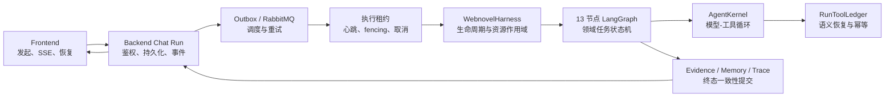

# Noval AI 问答当前架构

> 文档 ID：`noval-ai-current-architecture`
>
> 状态：`current`
>
> 发布边界：`repository`
>
> 最后审核：`2026-09-05`

## 1. 架构判断

Noval AI 问答不是“RAG 接口加一次模型调用”，而是由 Frontend、Backend 和 Worker 共同组成的分布式垂直 Agent Runtime：

- Frontend 负责发起、展示、恢复持久 Chat Run。
- Backend 负责用户/项目边界、会话与事件持久化、队列、租约、fencing、恢复和终态提交。
- Worker 负责 Harness 生命周期、LangGraph 编排、AgentKernel 工具循环、领域取证、专家路由、记忆和答案审查。

## 2. 三层职责

| 层 | 核心职责 | 主要源码 |
| --- | --- | --- |
| Frontend | 建立会话、启动 Run、消费 SSE、页面刷新后恢复、展示过程与 Trace | `frontend/src/views/knowledge/KnowledgeChatView.vue`、`frontend/src/views/knowledge/AdminAgentTraceView.vue` |
| Backend | 鉴权与项目隔离、Run/Event 持久化、outbox/RabbitMQ、租约与 fencing、心跳、恢复扫描、流式事件和最终提交 | `backend/src/main/java/com/novelanalyzer/modules/knowledge/service/KnowledgeChatRunService.java`、`KnowledgeChatRunRecoveryService.java`、`KnowledgeChatRunEventService.java`、`KnowledgeChatRunEventStreamService.java` |
| Worker | 意图、上下文、任务规划、工具、专家、市场证据、答案生成/复核、记忆候选、Trace、语义 checkpoint | `langgraph-worker/app/services/novel_research_agent.py`、`langgraph-worker/app/services/harness/webnovel_harness.py` |

Backend 不是 Worker 的薄代理。它通过数据库记录、执行租约、fencing token、心跳和终态检查避免旧 Worker 在失去租约后提交结果；Run delta 还会按字节/时间阈值批量和快照化，避免逐 token 写数据库。

回答提交与取消请求锁定同一 Run 行，并在同一事务内校验状态、lease owner 和 fencing token，因此二者遵循 first-wins：胜者提交唯一终态，loser 的 message/event/outbox 预写整体回滚。durable SSE 按 sequence/`Last-Event-ID` 重放 `CANCEL_REQUESTED`/`CANCELLED` 后关闭，不把取消终态合成为正常 `done`；compatibility SSE 在 delta 后观察到取消时也只进入失败/关闭路径。

## 3. 当前 13 节点图

当前图的事实源是 `langgraph-worker/app/services/harness/webnovel_harness.py::_build_graph()`：

1. `classify_intent`
2. `assemble_context`
3. `plan_tasks`
4. `validate_preconditions`
5. `execute_tools`
6. `supervise_evidence`
7. `route_experts`
8. `analyze_market_evidence`
9. `compose_answer`
10. `review_answer`
11. `revise_answer`
12. `extract_memory_candidates`
13. `finalize_trace`

其中证据监督、专家路由和答案复核存在条件分支。旧文档 `docs/ai-qa-rag-langgraph-runtime-flow.md` 只描述了早期的 intent、book resolver、data completer、retrieval、specialist、writer 和 citation verifier，不应再作为当前节点清单。

## 4. Harness 与 Kernel 边界

### 4.1 WebnovelHarness

`langgraph-worker/app/services/harness/webnovel_harness.py` 是运行时组装和生命周期根：

- 构造 Intent、Skill、Memory、TaskGraph、EvidenceArbiter、Supervisor、ContextCompactor。
- 构造 CapabilityCompiler/Authorizer、Prompt Injection Validator、Checkpointer、ToolRegistry 和 AgentKernel。
- 让阻塞 `run()` 与流式 `stream()` 共用取消、准入、预算、checkpoint、语义恢复和 Tool Ledger 作用域。
- 通过 `commit_run()` 对齐响应状态、EvidenceCommit、Memory Candidates 和 Trace，避免回答成功但治理状态互相矛盾。

这一层应继续拥有“如何安全运行一次网文问答”的横切规则。

### 4.2 AgentKernel

`langgraph-worker/app/services/harness/agent_kernel.py` 是领域中立的模型-动作-观察循环：

- 使用类型化消息、工具调用和 stop reason。
- 只向模型暴露 `AuthorizationDecision` 实际授予的工具 schema。
- 写入 `MODEL_PREPARED` 与 `MODEL_COMMITTED` 语义 checkpoint。
- 消费每个 Provider event 时检查取消；Provider iterator exhaustion 后、写 `MODEL_COMMITTED` 前再次执行现有 cancellation checkpoint。该窗口发生 late cancel 时保留 `MODEL_PREPARED`，不写假 `MODEL_COMMITTED`，也不发送正常 `message.end`、completed `turn.end` 或正常 `result`。
- 复用 `harness/context_compaction.py` 的 provider envelope 结果，在 `requestSummary.contextCompaction` 中记录 before/after `sha256:` surface 指纹、有限消息/工具计数和 `bodyRedacted=true`；不记录 Prompt、摘要正文或工具结果。
- 统计 Provider、cache 和 token 使用量。
- `provider_client.py` 在 OpenAI-compatible streaming/Chat/Responses 与 Dify 请求点统一校验 HTTP(S)、禁止凭据/query/fragment/空白和本地/私网/元数据目标，异步 DNS 解析遇到非公网地址、失败或空结果即拒绝，并禁用 HTTPX 环境代理继承（`trust_env=false`）。
- 持久化 `MODEL_PREPARED` 返回现有 `_event` 身份时，Kernel 只在后续 `MODEL_COMMITTED.requestSummary.contextCompaction.sourceEvent` 写入 schema-versioned、body-redacted 的 `eventId`/`sequence`/`eventType` 引用；恢复时，未提交 prepared event 转为 `MODEL_UNKNOWN` 前也会删除旧根 `_event`、严格校验同 run 身份并写入同一最小引用。缺失、legacy 或不匹配时均省略，不改变 Provider 输入面或新增持久化表面。
- 用有界轮次和 `KernelStopReason` 终止，包括预留的 `NEEDS_USER_INPUT`。

当前限制是：无工具时能够直接转发 Provider token；有工具时 `stream()` 主要先执行阻塞 kernel loop，再投影已经积累的事件，因此语义一致但不是跨工具轮次的真正实时 token streaming。

### 4.3 Agent Provider Profile

知识问答 Agent 通过现有 `/internal/knowledge/agent/runtime-config` 消费 Backend 模型注册表投影。`AgentProviderProfileVO` 只包含非密路由身份和能力字段：`profileKey`、派生 `profileVersion`、endpoint、model、providerType、显式 protocol、`providerCapabilities`、启用/默认状态和 Key 是否已配置。

- 模型注册表缺少协议的历史行统一标记为 `unspecified`，不按模型名推断 Responses 或 Chat Completions。
- `providerCapabilities` v1 包含 `schemaVersion=1` 与 `supportsStreaming`、`supportsTools`、`supportsJsonObject`、`supportsReasoning`、`reportsUsage`、`reportsCacheUsage` 六个完整布尔字段，并可选携带 Responses-only `promptCache` 子契约。子契约用 `strategy/mode/retention/breakpoint` 区分 DeepSeek 自动缓存、早期 GPT、GPT-5.6+ 和显式禁用。整个 capability 对象缺失表示 `legacy_unknown`；`promptCache` 缺失表示继续使用兼容模型规则，旧管理端省略整个对象时 Backend 保留已有声明。
- 管理端现有模型注册表表单可显式选择 `responses`、`chat_completions` 或 `unspecified`，并配置完整 capability v1。缓存策略只在 Responses 下启用，按策略渐进展示 mode、retention 和 breakpoint；首次配置时依据当前 `modelName` 给出 GPT/DeepSeek 推荐 preset，网关别名仍可手工声明。界面不把声明冒充真实网关验收；普通保存不回传 Key、掩码或配置状态，只有管理员主动输入替换 Key 时才发送 `apiKey`。
- 同一表单提供保存后 Agent 连接探针。浏览器只提交已保存条目的 `modelKey`；Backend 从当前 runtime catalog 取得 `profileVersion`，Worker 再通过 runtime-config、exact resolver 和 run-local dispatch scope 校验完整路由。未保存的 Key、endpoint、model、protocol 或 capability 变化会禁用探针，旧连接结果也不会继续套用于新草稿。
- Backend 保存前拒绝 trim 后重复的 `modelKey`，避免 exact resolver、探针或密钥解析对同名 Profile 使用 `findFirst()` 产生身份歧义。
- 探针使用固定合成输入、8 个最大输出 Token、8 秒单次 Provider timeout 和覆盖 runtime-config/resolve/admission/invoke 的 25 秒全程上限，复用正式 `ProviderClient` 的显式 protocol、SSRF 与重试规则。Worker 同一时刻只接纳一个管理探针，Frontend 同样串行触发，并丢弃配置保存期间返回的旧代次结果。
- 探针在解析凭据前拒绝非 HTTPS endpoint，并要求 Provider 的归一化结果包含非空正文才可标记成功。公开结果只含 Profile identity、endpoint SHA-256、实际 model/protocol、耗时和 usage/cache 字段是否报告；模型正文、endpoint、Key、原始响应与异常文本均被丢弃，Backend/Worker 响应都使用 `no-store`。
- “连接可用”只证明已保存 Profile 能完成一次基础非流式请求，不自动修改 capability 声明，也不等同于 tools、streaming、`json_object`、reasoning 或真实 KV Cache 验收。探针结果只保存在当前页面内存，不进入 Run/Event、checkpoint、Trace、Redis 或 RabbitMQ。
- 普通知识问答把前端选择的 `modelKey` 先在 Backend 注册表中解析为同一启用条目的 `modelKey + modelName`，再随受控 limits 交给 Worker。新 Run 在进入 LangGraph 前读取一次 governance，并优先用该 key/name 对冻结非密 Profile catalog；即使两个 Profile 共享同一上游 modelName，也不会退回列表首项。旧请求缺少 key 时仍按 modelName/默认 Profile 兼容；resume 复用 checkpoint 中的非密 catalog，不重新选择当前默认 Profile。
- intent、specialist、answer、review 仍可使用集合内的差异模型；只有模型名与当前选择条目一致时才使用所选 key，避免把主回答模型强加给独立 intent/review 模型。
- `profileVersion` 同时绑定 capability schema、六个布尔值与完整 `promptCache` 子契约。Worker 只把 capability 完全相同的显式 v1 Profile 放入同一 frozen catalog；缓存 strategy/mode/retention/breakpoint 任一变化都会产生新版本，`legacy_unknown` 只启用主 Profile，resolver 回包缺失或漂移 capability 时 fail closed。
- Backend 内部端点按精确 `profileKey + profileVersion` 解析启用条目的运行凭据，不做 alias/default fallback，并返回 `Cache-Control: no-store`。unknown/disabled、stale、缺 endpoint/protocol/Key 均在 Provider HTTP 前 fail closed。
- Worker 的 ContextVar scope 对每个 Profile 做 run-local single-flight 解析。`AgentKernel` 在 `MODEL_PREPARED` 前取得凭据，blocking 工具轮、direct streaming 和同路由重试复用同一内存对象；API/Agent 流式包装层显式关闭下层 generator，保证提前断流时同步清理 scope。
- `AgentKernel` 在 `MODEL_PREPARED` 前拒绝声明不支持的 streaming、tools、`json_object` 或 reasoning 请求；缺失 capability 的 legacy 路径保持兼容。`reportsUsage` 与 `reportsCacheUsage` 只是上游字段报告能力声明，响应中的 `usageReported` / `cacheUsageReported` 仍按原始字段是否真实出现计算，不阻断回答，也不证明缓存命中。
- blocking 与 direct streaming 在 checkpoint 前使用同一 canonical Provider 参数规则；未配置的 timeout 不进入任一路径，因此同一模型可见请求具有相同 `requestFingerprint` 和脱敏 `requestSummary`，而 transport-specific `semanticKey` 仍保持不同。`MODEL_UNKNOWN` 会保留原 PREPARED 的 fingerprint、模型、轮次和 canonical summary，只替换受信 compaction provenance 并增加 unknown outcome。
- Responses 缓存请求按每次实际 dispatch 的 `ProviderProfile.model + protocol + providerCapabilities.promptCache` 编译，不使用请求别名或全局默认模型。显式子契约优先；缺失时只对已配置模型规则做兼容推断：GPT-5.6+ 使用 `prompt_cache_key + prompt_cache_options(mode=implicit, ttl=30m)`，并把第一条稳定 system/developer 指令转换为带显式 breakpoint 的 developer `input_text`；早期 GPT 使用 key，只有显式 capability 才发送 `prompt_cache_retention=in_memory|24h`；DeepSeek 依赖自动 prefix cache，只发送不可逆匿名 `user` 隔离且不发送 OpenAI cache 字段。未知模型不发送专属字段，显式 `strategy=none` 可压制兼容推断；两个 legacy allowlist 重叠会 fail closed，超长 GPT affinity 会稳定压缩为 64 位 SHA-256 key。
- GPT-5.6+ 的顶层 `instructions` 不能承载 breakpoint，因此仅在选择 `stable_prefix` 时转换为 developer content block；`implicit` 可与该显式稳定边界并用，`explicit` 且无 marker 则不会创建 Prompt Cache 写入。Chat Completions 不接受本轮新增的 prompt-cache capability，Backend 与 Worker 均 fail closed。
- DeepSeek 的匿名 `user` 只用于用户、KVCache 和调度隔离，不是缓存条目键，不能强制或证明命中，也不能替代 Backend 的租户/项目授权；GPT 的 `prompt_cache_key` 同样只影响路由分组。wire snapshot 记录 `cacheIdentityMode`、`promptCacheStrategy` 和不可逆 `requestSettingsFingerprint`；后者覆盖实际 reasoning、`text.format`、parallel-tool、compaction 与 cache controls。真实命中仍只以 Provider usage 的 cache-read token 和受控重复样本验收。
- 该分层借鉴 Pi（`earendil-works/pi-mono`，审计提交 `92d8e2d17d4f357788381c49ce2cdb3f4ed1f21c`）与 OpenCode（`anomalyco/opencode`，审计提交 `51f86c853791c41656fb0adcf9413291e4996b87`）的共同结构：上层保持稳定、追加式历史和统一 usage，最终由 Provider/Protocol adapter 编译不同 wire 字段。Noval 没有引入本地通用 KV/Prompt cache，也没有复制其完整 Session/SQLite runtime。
- 一旦 catalog 中存在显式 Agent Profile，credential resolver 缺失会在进入图前失败，不能降级到 Worker 全局 Provider；只有没有可采用 Profile 时才保留旧全局配置兼容路径。
- 显式 Profile 不再继承 Worker 全局 `settings.openai_api_key`。checkpoint、Run/Event、Trace、Redis shadow 和 providerCalls 只保留非密 profile/version、endpoint fingerprint、model 和 protocol；Key 不进入 state、checkpoint、消息队列、Redis 或日志。
- `profileVersion` 不包含 Key 轮换代次，因此只能做单 Run 的短生命周期凭据复用，不能作为长期 Key cache 或完整 credential lineage。若生产需要旧 Key 可恢复或轮换代次审计，必须另行设计版本化密钥治理。
- 为兼容旧版管理端，保存请求省略 `protocol` 时 Backend 保留同一 `modelKey` 已有显式协议；新增条目仍保持 `unspecified`，避免静默猜测。
- 管理端可在现有第三方 Agent Profile 区域显式开启 `providerRoutingPolicy`，配置唯一且有序的 `orderedProfileKeys`、`maxFailovers=0..1` 和 `30..3600` 秒冷却。关闭状态或 `maxFailovers=0` 保持单 Profile 调用行为；候选必须具有相同 `providerType + protocol + providerCapabilities`，而 exact dispatch 仍校验 profile identity、endpoint、model 和 capabilities。
- Backend 把路由策略和当前 circuit 投影随 `/internal/knowledge/agent/runtime-config` 一次性下发。`circuitStates` 是以 `profileKey` 为键的对象映射；Worker 在首个 Provider dispatch 前冻结有序候选，备用凭据仅在切换时解析，切换成功的 winner 在当前 live `ProviderDispatchScope` 生命周期内 sticky，后续管理端修改只影响新 Run。
- `KnowledgeAgentProviderCircuitShadowService` 复用 Backend `StringRedisTemplate`，只以 `sha256(profileKey + separator + profileVersion)` 派生身份，保存整数失败计数和 TTL。Worker 通过现有内部通道 POST `/internal/knowledge/agent/provider-routing/outcome`；成功删除 shadow，连接失败、超时或 HTTP `429/500/503` 增加计数并按当前策略写入冷却 TTL。Redis 失败时 fail open，所有候选都投影为 OPEN 时 Worker 仍回退冻结顺序，避免可丢失读优化阻断 Run。
- 跨 Profile 切换只发生在当前 Profile 已耗尽 `ProviderClient` 路由内重试后，且最多一次。`400/401/402/422`、认证、预算、取消、格式和策略错误不切换；任一 Provider 流事件出现后不切换；`RunToolLedger` 已记录 write/idempotent 工具执行或恢复为 `unknown` 时也不切换。备用凭据解析失败会消费唯一一次切换，不会继续第三路。
- outcome 结算只接受当前启用、仍在显式策略中且 `profileVersion` 未变化的 Profile，并只返回脱敏 identity、state 和 failure count；它不进入 Run/Event/Trace/RabbitMQ，也不能改变 durable Run 事实。

因此 NewAPI/Sub2API 这类 Responses 网关可以直接复用现有 Agent Runtime 和独立注册表 Key，不需要新增 CPA、RabbitMQ route 或数据库迁移。当前已经具备默认关闭的有界跨 Profile 主备切换和 Redis 被动冷却，但它不是权重/轮询路由、全局热切换、主动健康探测或 Closed/Open/HalfOpen 完整熔断器；实际双 Profile 故障转移以及 Responses、工具、reasoning、structured output 与 KV Cache 能力仍须通过真实网关观测矩阵确认。

单书分析已从同一模型注册表读取 `modelKey`、`baseUrl`、专属 Key 和 `promptBindings`，但现有 `/internal/analysis` 传输仍未携带显式 protocol、capability 和 immutable profile version。它具备后续复用基础，但还不能宣称与知识问答 Agent 的 Responses Profile/dispatch parity 完全一致。

### 4.4 RunToolLedger

`langgraph-worker/app/services/harness/tool_ledger.py` 不是普通调用日志。它提供：

- run/user/project/route 作用域的语义调用身份。
- 只读结果复用、幂等写复用、并发调用 join 和写调用顺序化。
- 幂等键冲突、超时、取消、结果脱敏和预算控制。
- `TOOL_PREPARED`、`TOOL_COMMITTED`、`TOOL_UNKNOWN`、`TOOL_INVALIDATED` 的崩溃恢复语义。
- pre-cancelled 调用在 dispatch 和 `TOOL_PREPARED` 前被拒绝；已启动 handler 的最后 waiter 在收到取消终态前等待 cleanup 完成；prepared 后的取消以携带 `RunCancelledError` 的结构化 cancelled `TOOL_COMMITTED` 收口，不伪装成 timeout 或 unknown。

因此旧审计中“需要从零增加工具调用前置 checkpoint”的结论已过期。当前问题是把这套 Worker 语义与 Backend Run Event 统一成可版本化、可查询的契约。

## 5. 上下文、Skill、检索和领域治理

### 5.1 权威边界

`langgraph-worker/app/services/runtime/context_assembler.py`、`harness/trust.py` 与 `harness/validators.py` 明确区分：

- governed：system constitution、运行策略、授权决定。
- untrusted：Skill 正文、专家建议、记忆、网页/章节/RAG 证据和历史文本。

不可信内容以有界数据容器进入上下文，不能提升权限或改写系统约束。这是应保留的安全优势。

### 5.2 Skill

`langgraph-worker/app/services/skills/registry.py` 与 `skills/mediation.py` 已具备候选、版本、内容哈希、能力请求、激活预算、拒绝原因、BOM 和 Trace。能力请求仍须经过 CapabilityAuthorizer，不会因为加载 Skill 自动获得工具权限。

主要成本是多个匹配 Skill 正文可能在同一轮提前注入。更合理的下一步是目录摘要先入上下文，正文按精确 `skillId + version` 按需加载。

### 5.3 检索、证据与专家

- 检索规划：`langgraph-worker/app/services/harness/retrieval_planner.py`
- 检索融合/评估：`langgraph-worker/app/services/retrieval_fusion.py`、`langgraph-worker/app/services/retrieval_eval.py`
- 领域证据裁决：`runtime/evidence_arbiter.py`
- 专家注册/路由：`agents/expert_registry.py` 及 `ExpertRouter`
- Golden Eval：`evaluation/golden.py`、`evaluation/runner.py`

Noval 已覆盖项目隔离、时效性、检索指标、Trace 契约、control/candidate 对比和发布阈值。这些领域能力比通用 Harness 更深入，不应被通用插件系统替代。

## 6. 当前优势

1. **分布式执行真实可恢复**：Backend 租约、fencing、心跳、outbox 和恢复扫描与 Worker checkpoint 配合。
2. **阻塞/流式路径共享治理**：取消、预算、准入、checkpoint 和 Tool Ledger 没有两套业务语义。
3. **工具恢复语义强**：对已准备、已提交、结果未知和失效状态有明确区分。
4. **权限与内容信任分离**：Skill、记忆、正文和检索结果不能绕过 capability authorization。
5. **网文领域证据链完整**：最新榜单、项目 RAG、专家裁决、引用修复和答案审查均进入 Trace/Eval。
6. **终态有一致性协调**：回答、证据、记忆和 Trace 通过 Harness commit 统一收口。

## 7. 主要技术债务

| 债务 | 当前表现 | 风险 |
| --- | --- | --- |
| 领域编排集中 | `novel_research_agent.py` 超过 11,800 行，13 个图节点及大量策略仍是同一类的方法 | 修改局部节点时回归面大，单元测试和所有权不清晰 |
| 多套事件语义 | Backend Run Events、LangGraph/Kernel events、semantic checkpoints 分别演进 | 重放、Trace、SSE 和恢复可能出现字段/终态漂移 |
| 工具轮 streaming 不够实时 | 有工具时先完成阻塞循环，再投影事件 | 首 token 延迟高，用户难以看到模型与工具交错过程 |
| Skill 正文偏早注入 | 候选通过后可能批量进入 prompt | 上下文成本和稳定前缀抖动增加 |
| Profile 真实验收与凭据代次仍不完整 | v1 capability 声明、冻结比较和请求前门禁已闭环，但真实 DeepSeek/NewAPI/Sub2API 探针尚未执行，`profileVersion` 也不包含 Key 轮换代次 | 声明不能替代真实 stream/tools/reasoning/`json_object`/usage/cache 矩阵；跨重启 credential lineage 不能区分 Key 轮换 |
| Provider DNS 连接绑定未闭环 | 保存后基础探针已要求 HTTPS，现有公网 DNS 检查仍与 HTTPX 实际连接分两次解析 | 恶意或被劫持 DNS 可能在检查后重绑定；需要独立评审实际连接绑定/transport，不能由应用层 fingerprint 代替 |
| 交互续跑未闭环 | `NEEDS_USER_INPUT` 已定义但未形成耐久问答/审批协议 | 澄清或有副作用审批只能走定制外部流程 |
| Trace 替换链仍不完整 | provider envelope 压缩已有 before/after surface 指纹、有限计数和 semantic `sourceEvent`；成功提交与中断后 UNKNOWN 恢复都可引用有效 `MODEL_PREPARED`，但普通 provider-call Trace 的安全摘要与 LangGraph checkpoint 仍不保存该引用，也没有 current/shadowed/log-only 分类 | 可定位一次 replacement/unknown outcome 到准备事件，但仍不能解释每条输入的来源与完整生命周期 |
| 文档漂移 | 历史运行图落后于源码 | 评审、排障和新人理解建立在过期流程上 |

复杂度较高但不应只按行数重构的文件还包括 `harness/tool_ledger.py`、`harness/context_compaction.py`、`harness/agent_kernel.py`、`evaluation/runner.py`、`runtime/evidence_arbiter.py`、`agents/expert_registry.py` 和 `skills/registry.py`。拆分标准应是稳定契约和独立测试，而不是文件大小本身。

## 8. 主要源码索引

- Frontend：`frontend/src/views/knowledge/KnowledgeChatView.vue`
- Trace UI：`frontend/src/views/knowledge/AdminAgentTraceView.vue`
- Backend Run：`backend/src/main/java/com/novelanalyzer/modules/knowledge/service/KnowledgeChatRunService.java`
- Backend 恢复：`backend/src/main/java/com/novelanalyzer/modules/knowledge/service/KnowledgeChatRunRecoveryService.java`
- Backend 事件：`backend/src/main/java/com/novelanalyzer/modules/knowledge/service/KnowledgeChatRunEventService.java`
- Worker 领域编排：`langgraph-worker/app/services/novel_research_agent.py`
- Harness：`langgraph-worker/app/services/harness/webnovel_harness.py`
- Kernel：`langgraph-worker/app/services/harness/agent_kernel.py`
- Provider dispatch scope：`langgraph-worker/app/services/harness/provider_dispatch_scope.py`
- Provider：`langgraph-worker/app/services/provider_client.py`
- Provider cache capability：`backend/src/main/java/com/novelanalyzer/modules/config/model/AiPromptCacheCapabilities.java`
- Backend Provider governance：`backend/src/main/java/com/novelanalyzer/modules/knowledge/service/KnowledgeAgentGovernanceService.java`
- Backend cache continuity：`backend/src/main/java/com/novelanalyzer/modules/knowledge/service/KnowledgeAiCacheContinuityService.java`
- Backend Provider circuit shadow：`backend/src/main/java/com/novelanalyzer/modules/knowledge/service/KnowledgeAgentProviderCircuitShadowService.java`
- Backend 内部 Provider outcome：`backend/src/main/java/com/novelanalyzer/modules/knowledge/controller/KnowledgeInternalController.java`
- Tool Ledger：`langgraph-worker/app/services/harness/tool_ledger.py`
- Checkpoint：`langgraph-worker/app/services/checkpointing.py`
- Context：`langgraph-worker/app/services/runtime/context_assembler.py`
- Compaction：`langgraph-worker/app/services/harness/context_compaction.py`
- Eval：`langgraph-worker/app/services/evaluation/runner.py`

## 9. 生产验收状态

2026-08-18 的 Phase 159 r2 发布已验证当前 Worker/Frontend 变更与本架构描述一致：Worker 使用 Phase 158 `AgentKernel` 取消竞态 checkpoint，Nginx 静态资源包含 Phase 153 `ProjectExtractionReview` 候选级请求状态修复。Phase 141 cache-continuity Backend/configuration、Phase 160 动效以及数据库、Redis、RabbitMQ 和其他未审查工作区改动均明确排除。

候选在切换前通过依赖完整的 Worker 矩阵、资源策略 `25/25`、Provider 网络隔离和固定公共地址解析 `38/38`、Agent/Harness import、compile/import、Nginx `nginx -t`、`vue-tsc`、Vite build 与 Compose 校验；模拟 HTTP 传输没有真实出网，候选专属行为回归为零。生产 release 为 `phase159-resume-20260818-213455-r2`，Worker/Nginx 镜像和运行源码均通过 SHA-256 lineage 校验。

独立 postverify 确认 Worker 和 Nginx healthy、restart `0`、OOM `false`、origin/public health `200/200`、活动任务 `0,0,0,0`、严重日志 `0`，且 Backend、FastMCP、Crawler、MySQL、Redis、RabbitMQ、Qdrant 和 Cloudflared 的容器身份未变化。Worker 与 Nginx 均保留独立回滚镜像标签和发布前源码备份；本次没有触发自动回滚。

Phase 164-169 的 Responses Profile、缓存前缀契约与默认关闭路由截至 2026-08-29 已通过本地及 J3160 隔离候选验收，但生产切换未完成。Resume6 候选通过 Backend `78/78`、Worker `458`（skip `1`）、Frontend `7/7`、import/compile、Nginx/Compose/active gate；两次 Backend-only 切换均因候选 Backend 未在有界窗口内监听 8080 而自动回滚，隔离启动诊断返回 `code=137`。当前生产仍运行原 Backend/Worker/Nginx 镜像和源码，路由保持默认关闭；不能把候选状态解释为线上已启用，也不能宣称真实 DeepSeek KV Cache 命中或第三方网关故障转移。

Phase 165 的 `providerCapabilities` v1、Backend/Worker/Frontend parity、显式不支持的请求前门禁以及 usage/cache 字段存在性诊断已完成本地实现和聚焦回归。管理端的“已声明 v1”不代表真实网关已验证；本 Phase 同样未部署生产，真实 DeepSeek cache E2E 和 NewAPI/Sub2API Responses 能力探针仍是 Phase 164 外部门禁。

Phase 166 的保存后 Agent 基础连接探针与配置页状态已完成本地实现和 mock-backed 回归；最终审查后又补齐重复 Profile 身份拒绝、非空结果要求、全链 deadline、单探针 admission、HTTPS 前门禁和旧 UI 结果丢弃。它仍未部署生产，也没有使用真实第三方 Key，只能关闭“已保存 Profile 可进入正式 ProviderClient 并产生脱敏结果”的本地闭环，不能关闭 Phase 164 的真实网关能力矩阵、DeepSeek cache E2E、DNS rebinding、单书 analysis protocol parity 或自动跨网关故障转移门禁。

Phase 169 的有界 Provider 路由与故障转移已于 2026-08-24 完成本地实现和回归：Frontend 提供默认关闭的有序策略控件，Backend 保存/校验策略并维护 Redis TTL circuit shadow，Worker 在 route-local retry 耗尽后最多切换一次，并由 Provider 流事件和 Tool Ledger 副作用状态阻止不安全切换。该 Phase 未部署生产，未使用真实 Key，也未执行真实双 Profile/双网关故障注入；因此只能宣称本地契约与 mock-backed 跨层闭环完成，不能宣称生产可用性目标、真实切换成功率或完整熔断恢复已验收。

`ProviderDispatchScope` 的 active winner 和 `failoversUsed` 当前只在内存中维护。Worker 崩溃后 Resume 会复用 checkpoint 中冻结的 Profile catalog 与策略，但不会恢复上一次 winner；Redis OPEN shadow 可能使新 scope 避开刚失败的主路由，但它是 best-effort 提示而非耐久 sticky 证据。跨进程 winner 恢复需要独立 checkpoint/state 契约，本 Phase 不扩建。

上述 2026-08-29 的候选状态已由 2026-08-31 Phase 170 Resume8 生产切换取代：Phase 164-169 的累计 Backend/Worker/Nginx 候选已成功上线并通过启动、健康、源码/镜像 lineage、HTTP、重启/OOM、非目标容器不变和严重日志检查。生产模型路由仍因注册表没有 `providerRoutingPolicy` 而保持关闭，真实 Provider、DeepSeek/GPT 缓存命中和双网关 failover 仍未验收。2026-09-05 的 modelKey 精确选择、Responses GPT/DeepSeek capability 编译和 continuity v4 是本地已验证候选，尚未部署、未调用真实 Provider。
