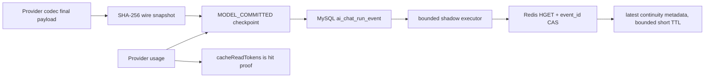

# Redis Provider Cache 连续性 Shadow 实现

> 文档 ID：`redis-cache-continuity-shadow`
>
> 状态：`current`；Phase 141/172/173/174 已实现，待候选发布与真实 GPT/DeepSeek 连续命中验收
>
> 发布边界：`repository`
>
> 日期：2026-09-05
>
> 目标：把 Pi/OpenCode 的 Provider adapter 与“相邻请求严格前缀”经验落到 Noval，同时保持 MySQL、Redis、RabbitMQ 和 Provider KV Cache 的职责边界

## 1. 本轮落地范围

当前实现由 Responses 请求编译与低风险 shadow 诊断两部分组成，不改变工具权限、回答逻辑或生产部署：

1. Backend 模型 capability 可显式声明 DeepSeek 自动、早期 GPT、GPT-5.6+ 或禁用；Worker 只在最终 `protocol=responses` 的 Profile 上编译相应缓存字段。
2. GPT-5.6+ 可发送稳定且最多 64 字符的 key、mode、30m TTL，并在稳定 developer content block 后放显式 breakpoint；早期 GPT 可发送 key 与按模型声明的 retention；DeepSeek 不接收 OpenAI cache 字段。
3. Worker 在最终 Responses/Chat Completions payload 组装后生成脱敏 wire snapshot。
4. `AgentKernel` 把真实 `wireApi`、cache read/miss/write tokens、reported/derived 标志和 snapshot 写入 `MODEL_COMMITTED` semantic checkpoint；显式 `0/false` 不会被旧 alias 覆盖。
5. Backend 在 durable event 成功后异步生成 Redis continuity projection。
6. Redis 只保留最后一个小型 TTL 状态；MySQL event 仍是 durable truth，Provider token usage 仍是缓存命中证据。

不在当前范围内：Chat Completions 新缓存控制、真实 GPT/DeepSeek E2E、cache-preserving LLM compaction、Langfuse 接入、RabbitMQ telemetry queue、Prompt/工具结果缓存。

## 2. 数据流与所有权



所有权规则：

- Worker 拥有最终 wire 编码与 hash-chain 生成。
- Backend MySQL 拥有事件顺序、用户/会话归属和 durable checkpoint。
- Redis 只是可丢失投影；Redis 不可用、队列饱和或旧事件竞争时直接跳过。
- Provider 返回的 `cacheReadTokens`/`cacheMissTokens` 是唯一命中证据；`prefixExtended` 只是原因诊断。

## 3. Wire Snapshot 契约

Responses 比较 `instructions + tools + input`；Chat Completions 比较前导 `system/developer + tools + messages`。字段只允许计数、枚举和不可逆 SHA-256：

| 字段 | 用途 |
| --- | --- |
| `schemaVersion` | snapshot 兼容版本，当前为 `1` |
| `provider/model/wireApi` | 请求族分区 |
| `requestFamily` | intent/specialist/answer/review 等模型请求面 |
| `routeFingerprint/affinityFingerprint` | 实际 Profile route 与逻辑 affinity 的不可逆身份 |
| `cacheIdentityMode` | `prompt_cache_key`、`provider_user` 或 `none`；只描述请求侧策略 |
| `promptCacheStrategy` | `openai_gpt_5_6`、`openai_legacy`、`deepseek_automatic` 或 `none`；绑定实际 Responses adapter |
| `stablePrefixFingerprint` | system/instructions 稳定面 |
| `toolsFingerprint` | 最终 wire tools 顺序与内容 |
| `requestSettingsFingerprint` | reasoning、`text.format`、parallel tools、compaction、mode/TTL/retention 等 prefix-sensitive settings 的联合哈希 |
| `surfaceGeneration` | model/wire/cache-strategy/settings/identity/family/route/affinity/stable/tools 联合代次 |
| `inputCount/inputFingerprint` | 当前完整 input/messages 状态 |
| `prefixChainFingerprints` | 证明上一请求是否为当前请求前缀 |
| `chainComplete` | hash-chain 是否覆盖全部输入项 |
| `bodyRedacted` | 必须为 `true`，否则 Kernel/Backend 拒绝投影 |

hash-chain 只携带有界数量的链哈希并保持小体积上限。超过上限仍计算完整 `inputFingerprint`，但无法证明任意旧长度时返回 `prefix_chain_unavailable`；不为了诊断无限增加 MySQL event 或 Trace 体积。

普通 Kernel Provider Trace 不保留 `prefixChainFingerprints`，只保留当前摘要。Backend 再执行一次字段白名单、长度和十六进制 SHA-256 校验，防止合法字段名夹带正文。

## 4. Continuity 判定

Redis scope 使用以下值的 SHA-256，不暴露会话 ID：

```text
userId + conversationId + provider + model + wireApi
+ requestFamily + routeFingerprint + affinityFingerprint + cacheIdentityMode
+ promptCacheStrategy + requestSettingsFingerprint
```

相邻状态按顺序给出一个稳定原因：

| 原因 | 含义 |
| --- | --- |
| `no_previous` | TTL 内没有同请求族基线 |
| `provider_changed/wire_api_changed/model_changed` | 实际 Provider 请求面变化 |
| `request_family_changed/provider_route_changed/cache_affinity_changed` | 请求族、Profile route 或 affinity 变化 |
| `cache_identity_mode_changed` | GPT keyed、DeepSeek provider-user 或无显式身份策略发生切换 |
| `prompt_cache_strategy_changed` | GPT-5.6、早期 GPT、DeepSeek 自动或禁用策略发生切换 |
| `request_settings_changed` | reasoning、结构化输出、并行工具、compaction 或 cache controls 发生变化 |
| `stable_prefix_changed` | system/instructions 变化 |
| `tools_changed` | 工具 surface 变化或排序抖动 |
| `exact_repeat` | 输入完全相同，不是严格扩展 |
| `input_shrunk` | 压缩/重建后输入项减少 |
| `input_rewritten` | 上一输入不是当前 hash-chain 前缀 |
| `prefix_chain_unavailable` | 上一长度超过本轮有界证明范围 |
| `prefix_extended` | 上一完整输入严格位于当前前缀 |

Redis 使用 `event_id` Lua CAS。多实例或延迟任务只能用更大的 durable event ID 覆盖状态，旧 checkpoint 不会把新投影倒退。

Phase 174 为新增 strategy/settings scope 将 Redis namespace 从 v3 断代为 v4；旧状态自然过期，不与新分类器混链。

## 5. 服务器压力与容量

本轮特意不在 checkpoint HTTP 线程同步等待 Redis。Backend 使用独立的有界 executor；具体线程数和队列容量以部署配置与压力验证为准。拒绝策略为立即丢弃 shadow 任务，不占用回答、SSE、Chat Run 或知识索引线程池。

每个成功的 `MODEL_COMMITTED` 最多产生：

- Worker 本地一次 O(n) canonical hash，输出有界数量的链哈希；无额外网络请求。
- Backend 异步一次索引化 `runId + userId` 会话查询、一次 Redis `HGET`、一次 Lua CAS。
- 一个短 TTL Redis hash，保存 `eventId + payload`，不保存 hash-chain、Prompt 或工具结果。

单 scope Redis 状态必须保持小型、带 TTL 并可由 `MEMORY USAGE` 和活跃 scope 数量监控。具体内存预算、淘汰策略和活跃 scope 上限以部署配置与灰度验收为准；达到预算前不得把完整上下文、回答或大 projection 加入当前实例。

## 6. RabbitMQ 后续边界

本轮没有把每次模型调用塞进现有 `EXECUTE/CANCEL` Chat Run 队列。该队列拥有运行调度和取消时效，混入高频 telemetry 会造成 head-of-line blocking，也会让 consumer action contract 失焦。

后续如需跨实例可靠聚合，建议独立切片：

1. MySQL outbox 新增受限事件 `AI_CACHE_TELEMETRY_RECORDED`，消息只携带 `eventId/runId`，consumer 回源 MySQL。
2. 使用独立 routing key、durable queue、DLQ、低并发和 bounded prefetch，不与 `EXECUTE/CANCEL` 共用消费队列。
3. consumer 按 scope/event ID 合并重复消息，再更新 Redis/指标存储。
4. 禁止 RabbitMQ 承载 Prompt、完整 snapshot、工具结果或 token-by-token SSE。

当该链路具备 outbox 重放、确认、DLQ 和压力测试后，可替换本轮进程内 shadow executor；在此之前，丢诊断优于拖慢回答。

## 7. 验证与剩余验收

已完成的本地契约验证：

- Responses/Chat payload snapshot 可比较且不含测试正文/cache affinity。
- blocking/streaming `MODEL_COMMITTED` 均携带 wire API、cache read/miss tokens 和脱敏 snapshot。
- Backend 能区分严格扩展、工具变化和输入重写，scope key 不暴露 conversation ID。
- Backend/Worker 能区分缓存 strategy 与 prefix-sensitive request settings 变化，Kernel 两层 allowlist 只保留枚举和 SHA-256。
- GPT-5.6+、早期 GPT、DeepSeek 和显式禁用的最终 Responses payload 均有无网络单元测试；capability 变化会改变 `profileVersion`。
- durable append 成功后才提交异步 projection；Redis 缺失、异常、饱和或旧 event CAS 失败均不影响回答。

生产前仍需：

1. 采集 Redis `used_memory`、key 数量、`MEMORY USAGE` 样本、executor reject 数和 projection 延迟。
2. 当前候选源码默认 `AI_CACHE_CONTINUITY_ENABLED=true`，而已部署生产仍显式为 `false`；发布前必须复核环境覆盖、Redis 容量与回滚边界，不能因源码默认值直接宣称线上启用。
3. 运行真实 GPT 与 DeepSeek Responses 同会话工具轮 + follow-up：GPT-5.6+ 检查 key/options/breakpoint 与 read/write tokens，早期 GPT 检查 retention/`cached_tokens`，DeepSeek 检查匿名 `user` 且无 OpenAI cache 字段；三者都联合检查 `prefixExtended` 与 Provider `cacheReadTokens > 0`。
4. 确认线上每个当前模型的 `providerCapabilities.promptCache`；旧条目才回落到 `AI_OPENAI_COMPATIBLE_PROMPT_CACHE_KEY_MODELS` / `AI_OPENAI_COMPATIBLE_PROVIDER_USER_MODELS`。未知模型默认不发送专属缓存身份字段。
5. OpenAI 字段与模型边界以官方 [Prompt Caching](https://developers.openai.com/api/docs/guides/prompt-caching) 为准；真实网关若拒绝声明字段，回到该 Profile capability 修正，不扩大 Provider 全局特判。
